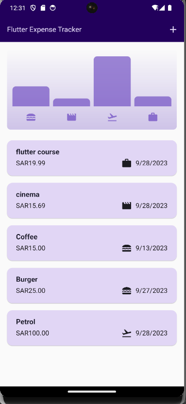
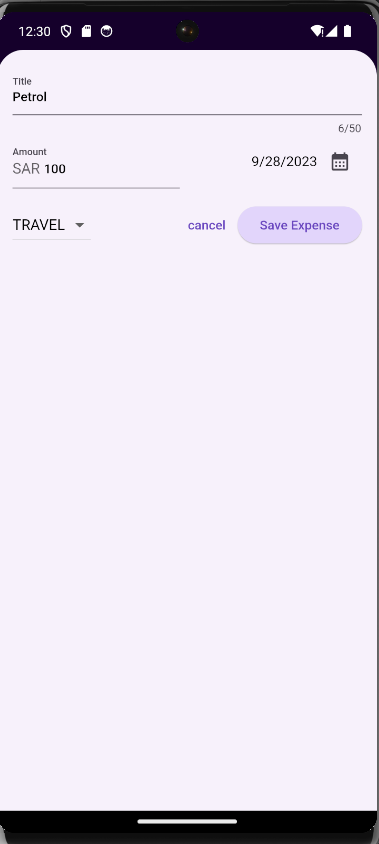

# expense_tracker

The Expense Tracker App is a user-friendly mobile application designed to help you manage your expenses efficiently. Whether you want to track your spending on food, leisure, work, or travel, this app has you covered. Easily add new expenses, view them in a bar chart, and swipe to delete unwanted entries.

## Screenshots

#### Home Screen

#### Add expens form

# Features

- **Expense Management**: Keep track of your expenses by adding new entries with a title, date, price, and category.

- **Bar chart**: View your spending habits at a glance with a bar chart that shows expenses categorized as food, leisure, work, and travel.

- **Intuitive User Interface**: The app's user-friendly design makes it easy to add, view, and manage your expenses.

- **Expense Deletion**: Swipe to delete unwanted expense entries from your list.
